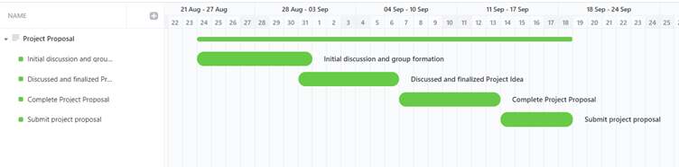
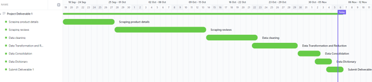
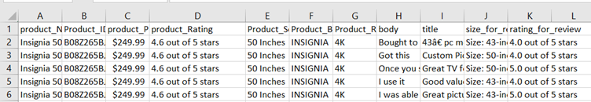
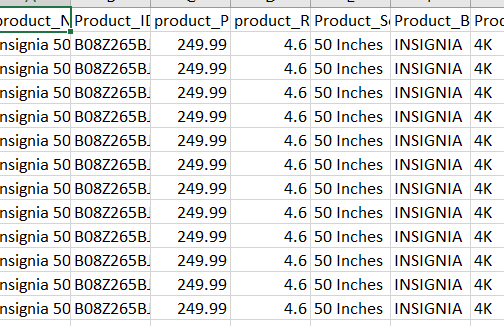
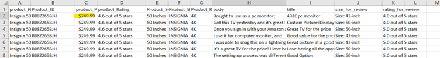
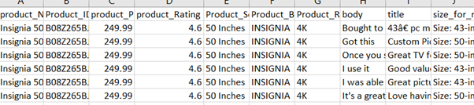

# Sentiment Analysis on Top selling Smart TV reviews

## Executive summary:

Amazon is most used e-commerce website to purchase electronic product. Global Smart Tv market is valued at 187.1 billion dollars in 2021 and it is expected to grow at least 10% over the next 5-10 years. It is very important to understand how customers are feeling about the Smart Tv’s they bought and their expectations. Our project works on examining amazon reviews for the top selling Smart Tv’s in USA. We want to understand opinions of the customers to analyse what kind of features they wants. We use descriptive and statistical analysis on this data to find insights. This proposed issue helps electronic manufacturers to come up with better and quality products that users expect and the features they like. The sentiment analysis on reviews will reveal the most common emotions felt by people and categorise the topics from the data.

## Statement of Scope
**Statement**
The purpose of this project is to identify the emotions felt by customers that bought the Smart Tv’s. For this project, we will be analysing data which is scraped from the amazon website using the product reviews on Smart Tv’s.

**Project Objectives:**
The project objectives include the following:

•	Extracting amazon review data for the top selling Smart Tv’s along with title, size of the tv, brand and review comments.

•	Performing descriptive statistical analysis on the data to identify insights on customers reviews and emotions.

•	Performing sentiment analysis which reveal the positive and negative reviews posted by customers

•	Analysing the review text using text analysis and categorise the common topics and issues raised by customers

**Unit of Analysis**

Our project analyses sentiment from amazon reviews for top selling Smart Tv’s. So, review body (review comments) is our unit of analysis.
## Project Schedule
The initial GANTT Chart Schedule, which includes all of the project's activities and tasks for first deliverable, is shown below. We have included the detailed Gantt chart from initial discussion to Submission of proposal. And in deliverable 1 Gantt chart we included all the steps and time spent on each steps like scraping the data, data cleaning, data transformation and reduction to submission.

## Data Preparation
We have scraped the data from amazon website for the top selling Smart Tv’s in USA. The mail goal of this project is to identify the most frequent emotions felt by customers that bought the Smart Tv’s from the amazon website. 

Final data file which contains product details and reviews:

https://github.com/msis5193-pds1-2022fall/project-deliverable-2-cowboys/blob/main/data/TV_Reviews.csv 

Python script to scrape reviews:

https://github.com/msis5193-pds1-2022fall/project-deliverable-2-cowboys/blob/main/code/Review_details.py  

Python script to scrape product details:  
https://github.com/msis5193-pds1-2022fall/project-deliverable-2-cowboys/blob/main/code/scraper_product_details.py   
Script to clean data:  
https://github.com/msis5193-pds1-2022fall/project-deliverable-2-cowboys/blob/main/code/Data_cleaning.py  
https://github.com/msis5193-pds1-2022fall/project-deliverable-2-cowboys/blob/main/code/Data_cleaning_on_review.py  
https://github.com/msis5193-pds1-2022fall/project-deliverable-2-cowboys/blob/main/code/Data_cleaning_2.py  

### Data Access
We have obtained the data from the amazon website. We have found a page for top selling 100 Smart Tv’s on amazon website in the below link
https://www.amazon.com/Best-Sellers-Televisions/zgbs/electronics/172659

We have written a code to extract the product details including product ID, title, price, brand and resolution. We used selenium to click on the next page at the bottom of this page to extract the product details from the remaining 50 Smart Tv’s. We installed chrome driver and using selenium it automatically launches a chrome window to extract the product details and uses this product details. We build URL based on the product id, then it navigates to URL to scrape the review. 
SampleURL:   https://www.amazon.com/Sony-Inch-Ultra-X80K-KD65X80K/product-reviews/B09P4C85N8/ref=cm_cr_dp_d_show_all_btm?ie=UTF8&reviewerType=all_review We have removed the extra text after the rating like “out of 5 star” from both Product_Rating and rating_for_review
s	

### Data Cleaning
Cleaning data is one of the important parts of any data science project. After data has been pulled from the amazon website various methods are used to clean the data.
*  We have removed the extra text after the rating like “out of 5 star” from both Product_Rating and rating_for_review

   Before cleaning

   
 
    After cleaning

   
 
* Removing the $ symbol from price.
  When we extracted the data, we see that $ symbol is appended at the start of the product price. We cleaned it for as a part of data cleaning.

  Before cleaning:

  

  After cleaning:

   

* Removing products that are not Smart Tv’s
  We found that 3 products are not actual Smart Tv’s but are Smart Tv antenna and cables. So, we have decided to remove those product details and     their reviews from our final data.
* Removing Inches text 
  In the Product_Screensize after the screensize number Inches text is added at the end of it, we have cleaned the data and change the variable       datatype from string to Float
  
* Removing stop words
*	Removing punctuation marks
*	Removing non-english words and rows from the body column
*	Removing numeric values wherever required
*	Removing white space characters such as \t, \n

 Before Cleaning:
 
 
 
 After Cleaning :
 
 

### Data Transformation
Making the rating column a numeric. We have converted product_rating and review_rating variable from string datatype to float datatype. We are getting extract text after the rating number ex: (4.0 out of 5) so we have deicide to remove the extra text after the float value. This helps us in better analysing and visualizing the data. We found that Amazon fire Tv products don’t have the brand names, we have extracted the brand name from the product name.

### Data Reduction
We did not create any new attributes or remove any attributes or records other than the missing values. We have just removed the reviews related to product that are not Smart Tv’s.

### Data Consolidation
We have extracted two files one for product details and other for product review details. We have merged both the files using product_id as the primary key. So, we were able to merge both the files successfully into a single file. We used python padas merge function based on product_id to merge our data into single file..

### Data Dictionary
A short description of the table below. Be sure to link each row to a data file in your directory `data` so I know where it is stored.

| ATTRIBUTE NAME      |      DESCRIPTION                                                         |        DATA TYPE  |          SOURCE  | Data                                  |
|---------------------|--------------------------------------------------------------------------|-------------------|------------------|---------------------------------------|
| Product _name       | Name of the product                                                      | String            | www.amazon.com   | [TV_Reviews.csv](data/TV_Reviews.csv) |
| Product_Id          | ASIN number which is unique for any item in amazon website               | String            | www.amazon.com   | [TV_Reviews.csv](data/TV_Reviews.csv) |
| Product_price       | Contains the price of the product                                        | float             | www.amazon.com   | [TV_Reviews.csv](data/TV_Reviews.csv) |
| Product_rating      | User rating of the product on amazon website                             | float             | www.amazon.com   | [TV_Reviews.csv](data/TV_Reviews.csv) |
| Product_screensize  | Describes diagonal Screensize of a product                               | String            | www.amazon.com   | [TV_Reviews.csv](data/TV_Reviews.csv) |
| Product_brand       | Describes the brand of a selected product.                               | String            | www.amazon.com   | [TV_Reviews.csv](data/TV_Reviews.csv) |
| Product_resolution  | Resolution defines the amount of horizontal and vertical pixels of tv    |  String           | www.amazon.com   | [TV_Reviews.csv](data/TV_Reviews.csv) |
| body                | Product review or feedback provided by the customers.                    | String            | www.amazon.com   | [TV_Reviews.csv](data/TV_Reviews.csv) |
| title               | Title of User review on products.                                        | String            | www.amazon.com   | [TV_Reviews.csv](data/TV_Reviews.csv) |
| Size_for_review     | Reviews of customers on products who bought different sizes of same tv.  | String            | www.amazon.com   | [TV_Reviews.csv](data/TV_Reviews.csv) |
| Rating_for_review   | Individual ratings of customers on products.                             | String            | www.amazon.com   | [TV_Reviews.csv](data/TV_Reviews.csv) |

## Text Mining and Sentiment Analysis
**TOPIC ANALYSIS** 

We wanted to group review text together based on the content of their body using Python. These topics can be used to aggregate the content and analyse large volumes of text data by clustering the documents into groups. We have decided to categorize them in to 3 topics.  

**Visualizations on the extracted data:**

From the above chart we can see that most number of TV’s had a screen size between 50-60 inches. 

From the above chart we can find that in the top selling amazon Tv’s majority of the TV’s had a resolution of 4k followed by 720p and 1080p. 

TCL and  SAMSUNG had more TV products both are having 18 products each in the top 100 best selling TV’s followed by INSIGNIA and Hisense.  

More than 40% of the TV’s had a price below $300 and the number of TV’s in the 100 decreases significantly as the price goes up.  

## LDA

Topic 1 (#0) : Products are at good price for the great quality tv with an easy to operate remote.  

Topic 2 (#1): Products are having good screen /monitor with great sound.

Topic 3 (#2): Tv are with good picture quality and good sound.

The following figure shows the distribution of text descriptions in topics using LDA:

## Emotions and analysis
**Trust**
In trust we see lot of words like happy, excellent, perfect, recommend and good which means customers are trusting the products they bought and would like to recommend it to others.

**Fear**

In fear we see words like problem, difficult, terrible which makes the customer dissatisfied with the product.

**Positive**

In Positive cloud we see word good, love, pretty, perfect which means customers are satisfied with the TV’s they bought and feel good about it.

**Negative**

Here we see words like problem, bad, annoying which makes the customer unsatisfied with the TV they bought.

## Classification Model:

The majority of business challenges never get to the solution stage because of a lack of data labelling. A team of data specialists, using business logic or pre-defined generic packages, and industry experts with domain knowledge often carry out the process of data labelling. They use the categorized data for model training and testing once they have a specific volume of it. The labelling of the data is essential for any classification issue.

We have the same challenge here with the data set. The review column is not a classified data. We used python package “vader” to process the text data and do the sentiment analysis. This package does not consider and review specific terms to do the analysis.

Below is the bar plot that shows the review distribution based on the sentiment.

Below is the confusion matrix for positive,Negative and neutral reviews.

Because the reviews are for top selling products, there are more number of positive reviews.

## Conclusion and Discussion
**Summary of data gathering strategies**

While we are scraping the data all the products on amazon website didn’t load completely, we had to send keys to scroll across the webpage to scrape the data and it took lot of time for script to run. We will try to optimize our code so that it takes less time to extract the data.

**Future Implications:** 
Our research mainly focuses on retail Smart TV consumers; this analysis help the product manufactures to design the TV’s that meet customer expectations. And it further helps to bring new innovations into this fields.

From the analysis we found that most of the reviews are positive that is the reason there are the top 100 best selling Tv’s on Amazon. Most of the customers are buying the Tv’s with the price below three hundred dollars. We see that lot of Tv’s in the top selling had 4k resolution. We also found that a Tv with good sound quality is something that customers are looking for.

